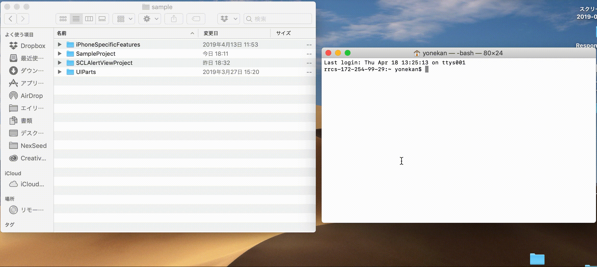
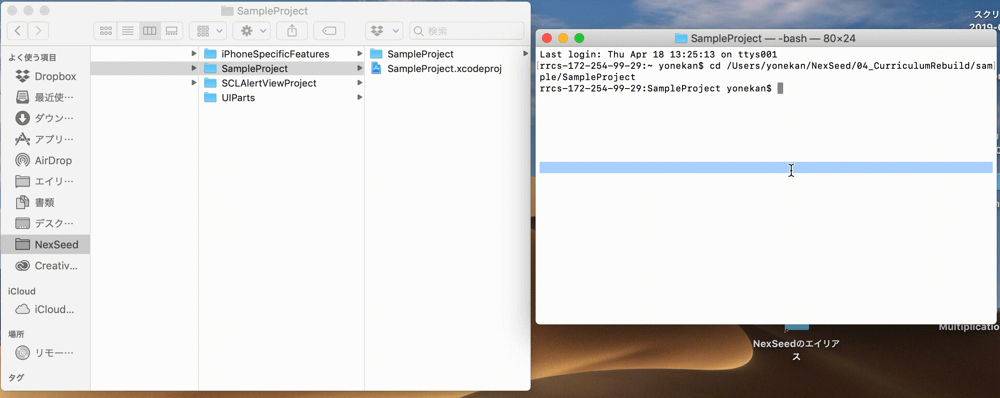
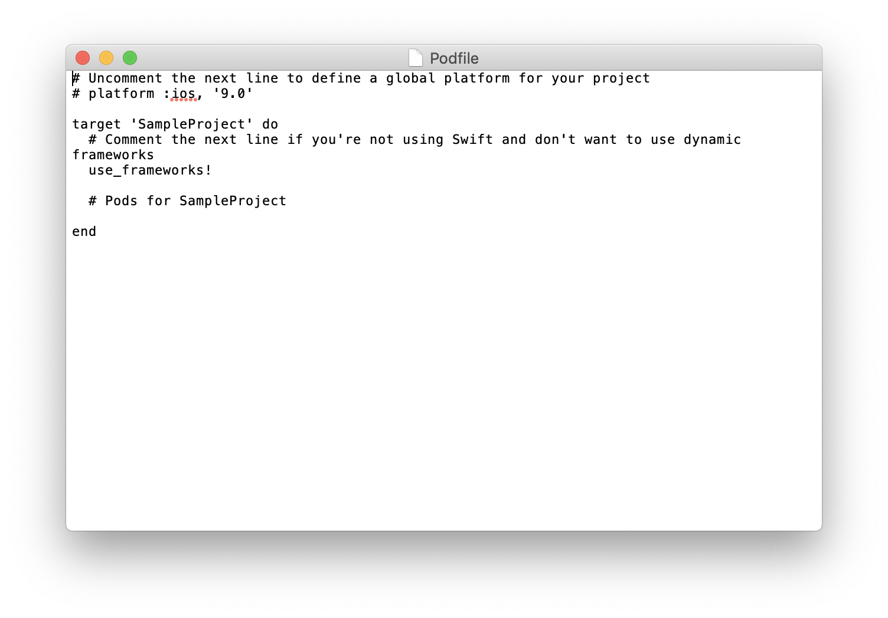
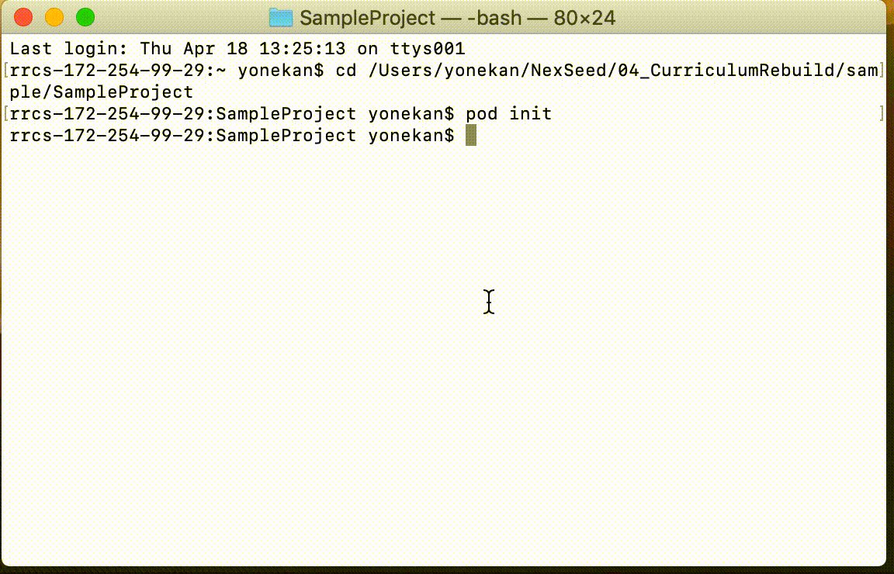

# XcodeプロジェクトへのCocoaPods導入手順

## 導入の流れ
1. プロジェクトを作成する
2. プロジェクト内にPodfileを作成する
3. Podfileに使用するライブラリを追記する
4. ライブラリインストールを実行する
5. 〇〇.xcworkspaceを開く

## CocoaPodsを導入しよう
1. プロジェクトを作成する  
	[01_はじめてのアプリ開発](../../02_UIParts/01_はじめてのアプリ開発.md)と同じように新規プロジェクトを作成する。  
	アプリ名：SampleProject

2. プロジェクト内にPodfileを作成する
	1. SampleProjectを開いていたら、XCodeを一度全て閉じてください。

	2. ターミナル（またはiTerm）を開く

	3. ターミナル上で、SampleProjectのプロジェクトがあるフォルダまで移動する  
	ターミナルに```cd```と入力し、半角スペースを開けて、FinderでSampleProjectを選択し、ターミナルまでドラッグ＆ドロップする。
	その後Enterキーを押下する
		

		> Enterキー押下後、以下のように「SampleProject」と表示されていれば成功です
		

	4. ターミナルで以下のコマンドを入力し、実行する。  
		```
		pod init
		```

		

3. Podfileに使用するライブラリを追記する
	
	1. SampleProjectフォルダ内作成された、「Podfile」を開く。

		

	2. インストールするライブラリを```# Pods for SampleProject```の下に追記する  

		例
		
		```
		# Uncomment the next line to define a global platform for your project
		# platform :ios, '9.0'

		target 'SampleProject' do
			# Comment the next line if you're not using Swift and don't want to use dynamic frameworks
			use_frameworks!

			# Pods for SampleProject
			pod 'SCLAlertView'

		end
		```

4. ライブラリインストールを実行する

	1. 以下のコマンドをターミナルで実行して、インストールする。  
			```
			pod install
			```

		

5. 〇〇.xcworkspaceを開く

	> SampleProjectフォルダ内に、「SampleProject.xcodeproj」と「SampleProject.xcworkspace」の２つがあると思います。  
  	> CocoaPodsを使って、ライブラリをインストールした場合は、必ず**白いアイコン**の「〇〇.xcworkspace」の方を開くようにしてください。
