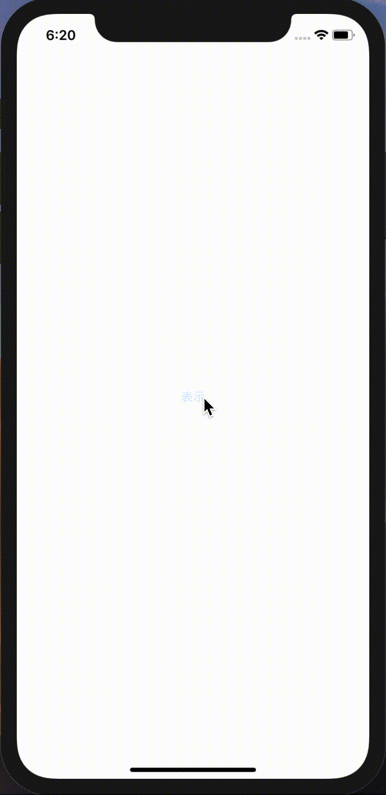
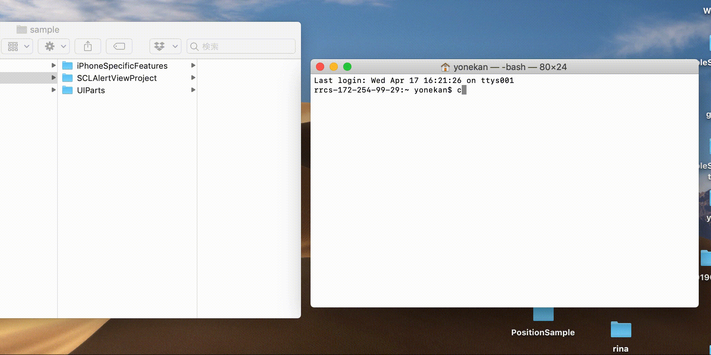
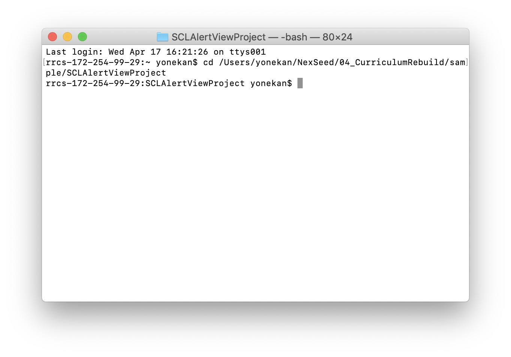

# CocoaPodsを使ってみよう

## 今回作成するアプリ
<!---->

## 使用するライブラリ
[SCLAlertView-Swift](https://github.com/vikmeup/SCLAlertView-Swift)	

> 上記のライブラリを使用すると、綺麗なデザインのアラート画面を簡単に作成することができます。

## 開発の流れ
1. プロジェクトを作成する
2. CocoaPodsを使ってライブラリをインストールする
3. 画面の部品を配置する
	- Buttonの設置
4. 配置した画面の部品をプログラムで扱えるよう設定する
5. 配置したボタンが押された時、インストールしたライブラリを実行する

## 開発しよう
1. プロジェクトを作成する  
	[01_はじめてのアプリ開発](../../02_UIParts/01_はじめてのアプリ開発.md)と同じように新規プロジェクトを作成する。  
	アプリ名：SCLAlertViewProject

2. CocoaPodsを使ってライブラリをインストールする
	1. SCLAlertViewProjectを開いていたら、Xcodeを一度全て閉じてください。

	2. ターミナル（またはiTerm）を開く

	3. ターミナル上で、SCLAlertViewProjectのプロジェクトがあるフォルダまで移動する  
	テーミナルに```cd```と入力し、半角スペースを開けて、FinderでSCLAlertViewProjectを選択し、ターミナルまでドラッグ＆ドロップする。
	その後Enterキーを押下する
		

		> Enterキー押下後、以下のように「SCLAlertViewProject」と表示されていれば成功です
		
